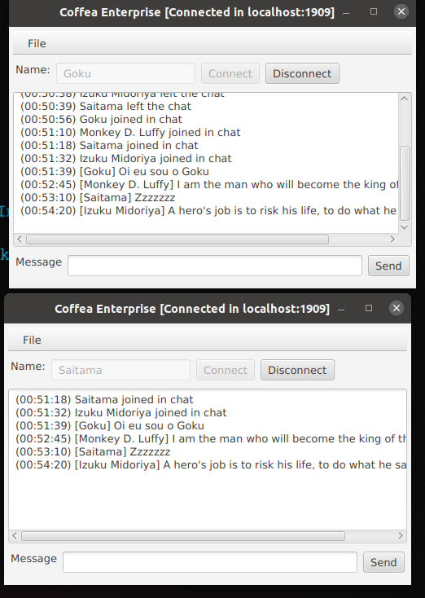
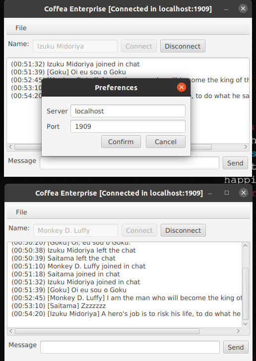
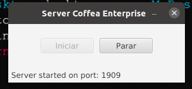

# Chat-SimpleExample

This project is a very simple chat. Where it is possible to make the simultaneous connection between local or remote users. My next step will be to implement internationalization, being able to choose between English or Portuguese, I believe it will be a very interesting experience. When I have more time I will comment on the entire code. Sorry, my english is not very good, and Google-Translator doesn't help much.

Este projeto é um exemplo simples de chat. Onde é possível fazer conexões simultâneas entre usuários local ou remoto. Meu próximo passo será implementar a internacionalização, sendo possível escolher entre os idiomas inglês ou português, acredito que será uma experiência muito interessante. Quando tiver mais tempo irei comentar todo o código.

**IMAGES**

## Bio
# Willian Carrijo

:coffee: Apaixonado por programação. Atualmente estudando Java, pretendo trabalhar na área.
Buscando colaborar em outros projetos, pronto para novos desafios.

:email: &nbsp; Entre em contato comigo:  
|

